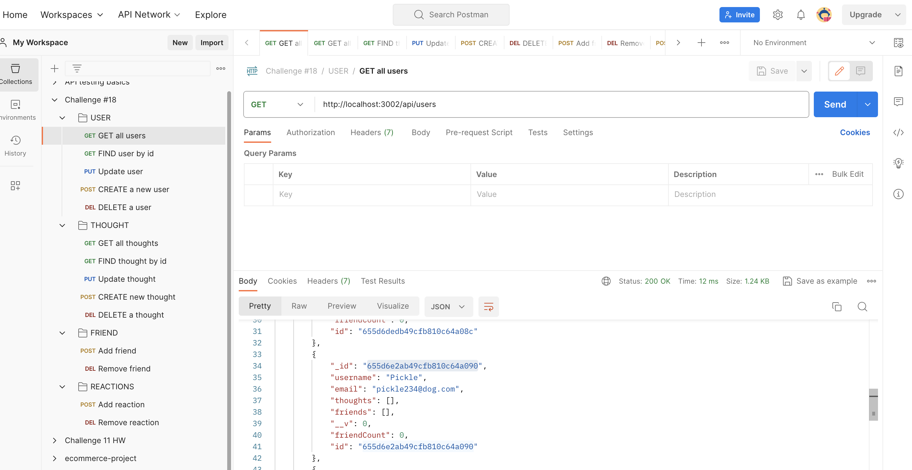

# social-network-API

## Description

This project was to build an API for a social network application where users are able to share their thoughts, and reactions. Additionally, they are able to create a user profile, update their profile and add friends as well. MongoDB was used as the document database.

## Table of Contents

- [POSTMAN](#postman)
- [Website Links](#websitelinks)
- [Technical Requirements](#technicalrequirements)
- [Credits](#credits)
- [License](#license)

  
## POSTMAN

GET Request for users:

GET Request for thoughts:

  
## Website Links

* Github Repo:https://github.com/lavollmer/social-network-API

* Video Demonstration: https://watch.screencastify.com/v/NZpneFrpxCgNomJ7fDWk

  
## Technical Requirements
Technical requirements for the application include:
* Mongoose ORM
* MongoDB
* Express.js
* Javascript Date object
* POSTMAN
* MVC Structure

  
## Credits

This project was done in conjunction with the U of MN Bootcamp Fall 2023.

Tutoring services were used to help debug, help with logic and coding. 

Code was inspired from these websites:
* Validate Email: https://stackoverflow.com/questions/18022365/mongoose-validate-email-syntax
* Timestamps: https://mongoosejs.com/docs/timestamps.html
* Date Code: https://mongoosejs.com/docs/guide.html

Activity 17 inspired connection.js, index.js, and subdocument code/information. 

Xpert Learning Assistant provided this code (some of it was changed or not needed):

const User = require('../models/User');

const addFriend = async (req, res) => {
  try {
    // Retrieve the user's _id and friend's _id from the request parameters
    const { userId, friendId } = req.params;

    // Retrieve the user's information from the database
    const user = await User.findById(userId);

    // Retrieve the friend's information from the database
    const friend = await User.findById(friendId);

    // Check if the user and friend exist
    if (!user || !friend) {
      return res.status(404).json({ error: 'User or friend not found' });
    }

    // Add the friend's _id to the user's friends array
    user.friends.push(friendId);

    // Save the updated user's information back to the database
    await user.save();

    res.status(200).json({ message: 'Friend added successfully' });
  } catch (error) {
    console.error(error);
    res.status(500).json({ error: 'Server error' });
  }
};

module.exports = { addFriend };

Also received this code from Xpert Learning Assistant, however I changed it:

async removeThought(req, res) {
  try {
    const thought = await Thought.findOneAndDelete({ _id: req.params._id });

    if (!thought) {
      return res.status(404).json({ message: 'No such thought exists' });
    }

    res.json({ message: 'Thought successfully deleted' });
  } catch (err) {
    console.log(err);
    res.status(500).json(err);
  }
}

  

## License
No license